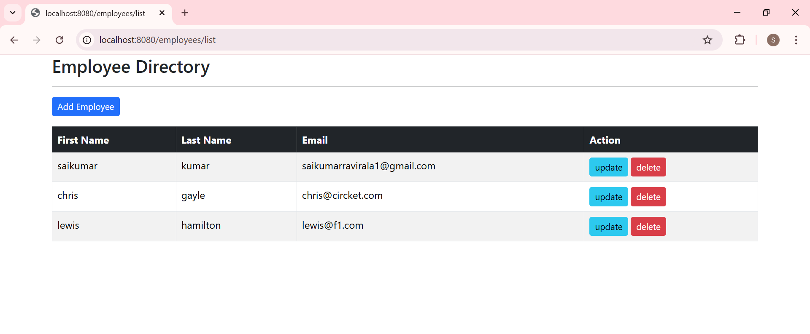
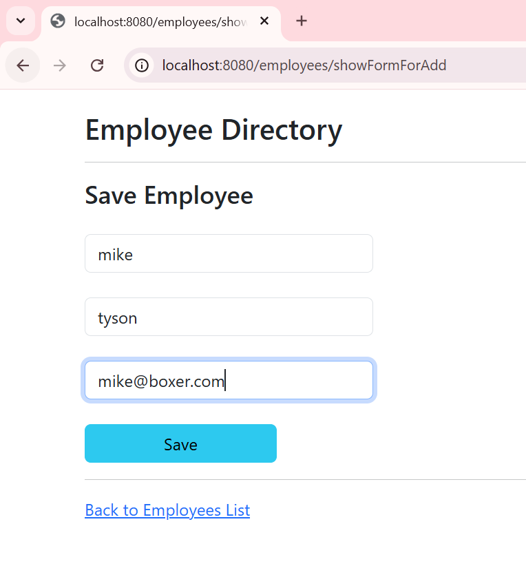

# Employee Management System

A Spring Boot web application with Thymeleaf and MySQL to manage employee records via CRUD operations.

---

## 🎯 Features

- Add, view, update, and delete employee records  
- MVC architecture with `Controller` → `Service` → `Repository`  
- Server-side rendering using Thymeleaf templates  
- Form validation, clean user interface  
- Screenshots included to showcase key views

---

## 🛠️ Tech Stack

| Layer       | Technologies                      |
|-------------|-----------------------------------|
| Backend     | Spring Boot, Java                 |
| Frontend    | Thymeleaf, HTML, CSS              |
| Database    | MySQL                             |
| Build Tool  | Maven                             |
| Versioning  | Git, GitHub                       |

---

## 🚀 Setup & Run

1. **Clone the repo**  
   ```bash
   git clone https://github.com/Saikumar-Ravirala/employee-management-springboot.git
   cd employee-management-springboot
2. **Prepare the database (MySQL)**
   CREATE DATABASE employee_db;
   Update src/main/resources/application.properties with your MySQL credentials.
3. **Build & run application**
    mvn clean install
    mvn spring-boot:run
    Access the app at http://localhost:8080.

---

## 🖼️ Screenshots

**Home Page**

   

 **Add Employee Form**
 
   

---

## 🧩 Project Structure

src/
├── main/
│   ├── java/com/sai/springboot/cruddemo/
│   │   ├── controller/
│   │   ├── entity/
│   │   ├── repository/
│   │   └── service/
│   └── resources/
│       ├── templates/   ← Thymeleaf HTML views
│       └── application.properties
└── test/

